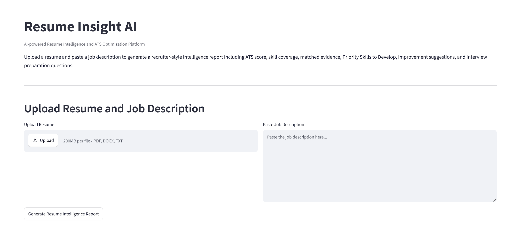
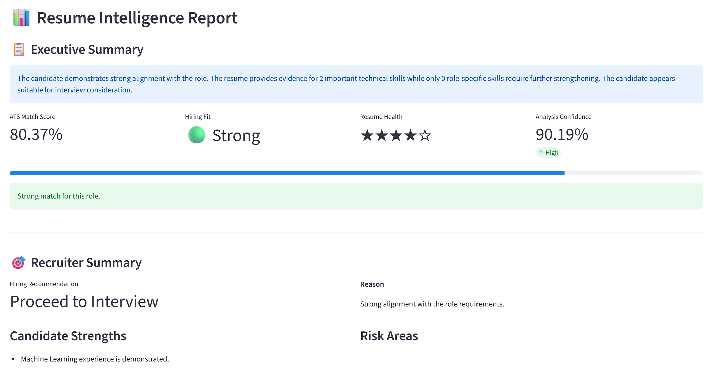
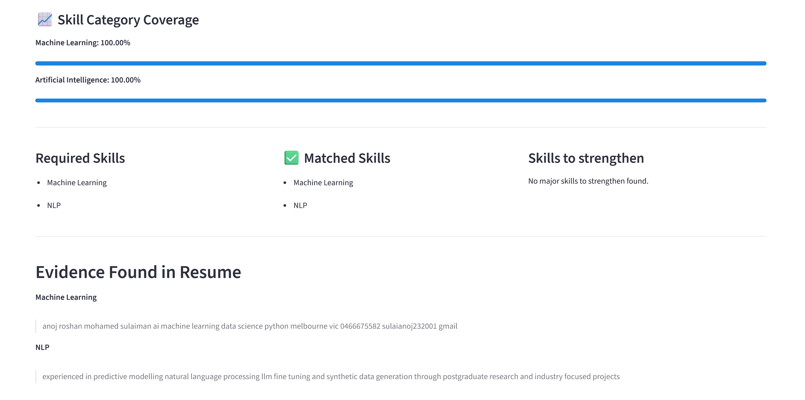
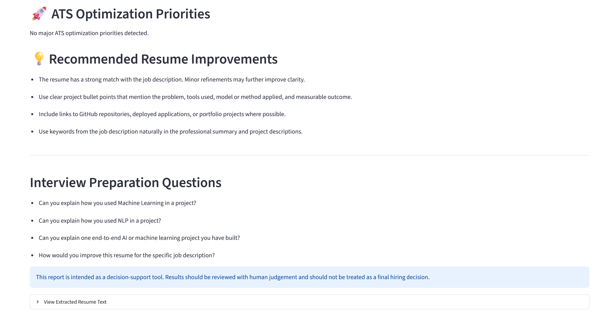
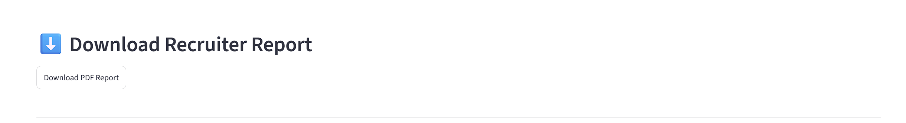
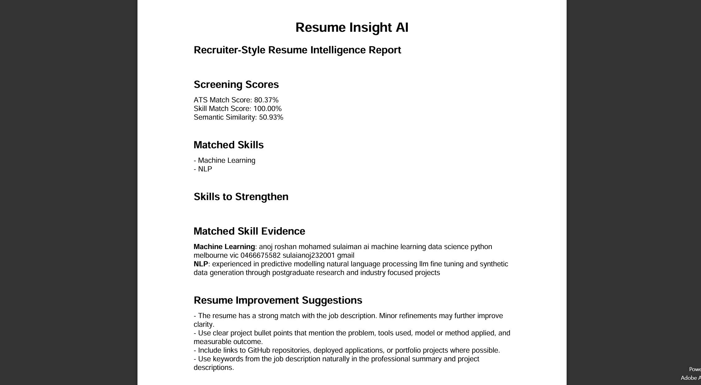

# Resume Insight AI

> AI-powered Resume Intelligence and ATS Optimization Platform built with Python, Streamlit, NLP, and Sentence Transformers.

Resume Insight AI is an intelligent resume screening platform that analyses a candidate's resume against a job description using Natural Language Processing (NLP), semantic similarity, keyword matching, and evidence extraction. It produces recruiter-style insights, ATS match scores, skill gap analysis, interview preparation questions, and a downloadable PDF report.

---

## Features

- ATS-style Resume Match Score
- Intelligent Keyword Skill Matching
- Semantic Resume-to-Job Matching using Sentence Transformers
- Evidence-based Skill Validation
- Recruiter-style Executive Summary
- Hiring Recommendation
- Resume Health Rating
- Skill Category Coverage Analysis
- Skills to Strengthen
- ATS Optimization Priorities
- Resume Improvement Suggestions
- Interview Preparation Questions
- Downloadable Recruiter PDF Report

---

## Project Architecture

```
                     Resume
                        │
                        ▼
                Resume Parser
                        │
                        ▼
             Text Preprocessing
                        │
                        ▼
        ┌──────────────────────────────┐
        │        AI Engines            │
        │                              │
        │ • Keyword Engine             │
        │ • Semantic Engine            │
        │ • Evidence Engine            │
        │ • Scoring Engine             │
        └──────────────────────────────┘
                        │
                        ▼
           Skill Category Analysis
                        │
                        ▼
           ATS Optimization Engine
                        │
                        ▼
           Report Generation Engine
                        │
                        ▼
          Resume Insight AI Dashboard
```

---

## Technology Stack

### Programming Language

- Python

### User Interface

- Streamlit

### Natural Language Processing

- Sentence Transformers
- Scikit-learn

### Document Processing

- PyPDF2
- python-docx

### Report Generation

- ReportLab

### Data Processing

- NumPy
- Pandas
- JSON

---

## Project Structure

```text
resume-insight-ai/

├── app.py
├── requirements.txt
├── README.md
├── .gitignore
│
├── data/
│   ├── jobs/
│   ├── resumes/
│   └── skills/
│       ├── skills_database.json
│       └── skill_categories.json
│
├── images/
│
├── notebooks/
│
└── src/
    ├── parser.py
    ├── preprocessing.py
    ├── similarity.py
    ├── category_analysis.py
    ├── ats_optimizer.py
    ├── report_generator.py
    ├── recommendations.py
    ├── config.py
    ├── skills.py
    ├── intelligent_matcher.py
    │
    └── engines/
        ├── __init__.py
        ├── keyword_engine.py
        ├── semantic_engine.py
        ├── evidence_engine.py
        └── scoring_engine.py
```

---

## How Resume Insight AI Works

1. Upload a resume (PDF, DOCX or TXT).
2. Paste the target job description.
3. Resume text is extracted and preprocessed.
4. Required technical skills are identified from the job description.
5. Keyword Engine performs exact and intelligent skill matching.
6. Semantic Engine analyses contextual similarity using Sentence Transformers.
7. Evidence Engine extracts supporting resume statements.
8. Scoring Engine calculates ATS match score and confidence.
9. Skill categories and optimization priorities are generated.
10. A recruiter-style intelligence report is displayed.
11. A professional PDF report can be downloaded.

---

## Screenshots

### Home Page



---

### Resume Intelligence Report



---

### Skill Category Coverage & Evidence explorer



---

### ATS Optimization Priorities



---

### PDF Recruiter Report




---

## Installation

Clone the repository.

```bash
git clone https://github.com/yourusername/resume-insight-ai.git
```

Move into the project directory.

```bash
cd resume-insight-ai
```

Create a virtual environment.

```bash
python -m venv .venv
```

Activate the environment.

### Windows

```bash
.venv\Scripts\activate
```

### macOS / Linux

```bash
source .venv/bin/activate
```

Install dependencies.

```bash
pip install -r requirements.txt
```

Run the application.

```bash
streamlit run app.py
```

---

## Example Output

Resume Insight AI generates:

- ATS Match Score
- Hiring Recommendation
- Resume Health Rating
- Analysis Confidence
- Skill Category Coverage
- Required Skills
- Matched Skills
- Skills to Strengthen
- Evidence Explorer
- ATS Optimization Priorities
- Resume Improvement Suggestions
- Interview Preparation Questions
- Downloadable PDF Recruiter Report

---

## Future Enhancements

- Multi-resume comparison
- Resume ranking for recruiters
- AI-generated resume rewriting
- Cover letter generation
- OCR support for scanned resumes
- Applicant Tracking Dashboard
- Recruiter authentication
- Resume benchmarking against successful candidates

---

## Disclaimer

Resume Insight AI is intended as a decision-support tool. The generated ATS scores, recruiter recommendations, and resume insights should assist recruiters and job seekers but should not replace human judgement during recruitment.

---
## Author

**Anoj Roshan M**

Master of Information Technology (Professional)
Deakin University

LinkedIn: *www.linkedin.com/in/anoj-roshan-m-4b3739205*
